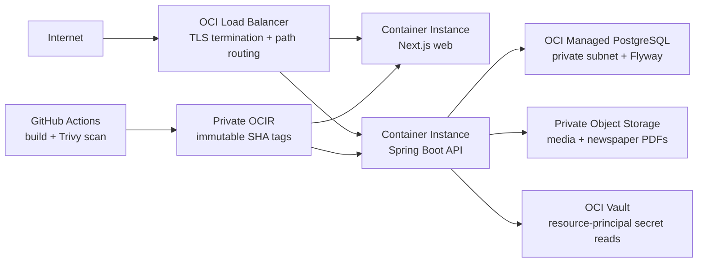

# OCI production architecture

Milestone 9 adds a production deployment shape without changing the local Compose workflow. Staging and production are separate Terraform roots and should use separate OCI compartments, VCNs, buckets, Vaults, databases, Terraform state, and GitHub environments.

Terraform provisions the following baseline:

- A VCN with public load-balancer, private application, and private database subnets. Network security groups permit public HTTP/S to the load balancer, load-balancer-to-container traffic, and container-to-PostgreSQL traffic only.
- A public flexible load balancer. `/api`, `/actuator`, and `/v3` route to the API; other paths route to Next.js. Supplying an OCI Certificates OCID creates HTTPS and an HTTP-to-HTTPS redirect. DNS records remain an operator responsibility.
- Two OCI Container Instances using private VNICs and exact image references supplied by the workflow. The backend enables resource-principal authentication for Object Storage and Vault access.
- OCI managed PostgreSQL in the private database subnet with OCI-optimized regional durable storage and scheduled backups. The pinned provider version exposes the supported backup policy in this module; point-in-time recovery should be enabled and verified in the target OCI service/provider version before production approval. Flyway runs from the single backend container at startup; deployment smoke tests wait for readiness before completion.
- One private, versioned Object Storage bucket. Images, advertisements, covers, and PDFs are stored behind the existing storage interfaces. The application streams them through the API; newspaper PDF keys are never made public and no pre-authenticated URL is generated.
- An OCI Vault and software KMS key for the private media bucket. Database/JWT/bootstrap secret values are referenced by OCID and loaded at startup using the container's resource principal. The Vault dynamic-group policies are deployment prerequisites and are intentionally not guessed by Terraform.
- An OCI Logging log group and optional Monitoring alarms when a notification topic and alarm map are supplied. Container stdout/log connector configuration and on-call ownership remain deployment-specific.

The storage abstraction preserves local behavior. `MEDIA_STORAGE_TYPE=local` uses the Compose named volume; `MEDIA_STORAGE_TYPE=oci` uses private Object Storage. The browser-facing API base URL is generated at container start, so the same web image can be promoted between environments.

## Required OCI setup outside this repository

Create and record the following before running Terraform:

1. An OCI compartment, tenancy namespace, region, availability domain, and an OCI Certificates certificate for production HTTPS.
2. An OCI Vault dynamic group policy allowing the backend Container Instance resource principal to read the configured secret OCIDs and use the KMS key. Grant Object Storage access only to the target bucket.
3. A Vault secret containing an OCIR auth token in the format expected by OCI Container Instances image-pull secrets. The Terraform variable is the Vault secret OCID; it does not create or print the token.
4. A GitHub Actions identity with the minimum ability to push to the two OCIR repositories and manage the selected Terraform state backend. Runtime resource-principal access is separate from CI credentials.
5. Private Terraform HTTP state endpoints, one for each environment, with locking and access controls. Never commit `*.tfvars`, state, plans, OCIR tokens, or Vault values.
6. DNS A/AAAA records for the load-balancer address and a notification topic if alert delivery is required.

The OCI provider and resource schemas should be checked against the installed provider version during deployment. Reference documentation: [Container Instances](https://docs.oracle.com/en-us/iaas/tools/terraform-provider-oci/latest/docs/r/container_instances_container_instance.html), [managed PostgreSQL](https://docs.oracle.com/en-us/iaas/tools/terraform-provider-oci/latest/docs/r/psql_db_system.html), [Object Storage buckets](https://docs.oracle.com/en-us/iaas/tools/terraform-provider-oci/latest/docs/r/objectstorage_bucket.html), and [OCI SDK authentication](https://docs.oracle.com/en-us/iaas/Content/API/Concepts/sdk_authentication_methods.htm).
